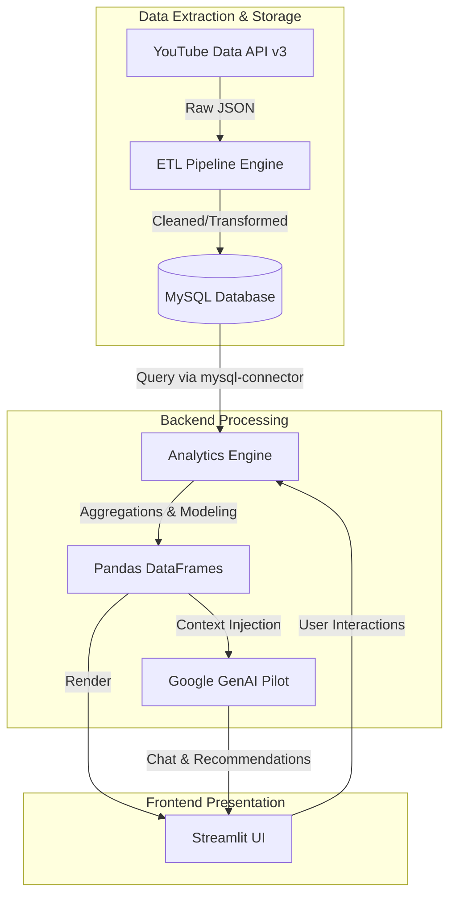
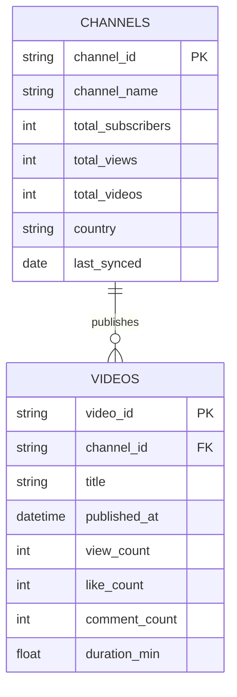

# 📊 YouTube Analytics Dashboard & AI Strategy Pilot

<div align="center">
  
  
  
  
  
  
</div>

<br/>

> **An enterprise-grade, end-to-end YouTube Analytics platform.** This project is designed to harvest raw channel data, perform complex transformations via an automated ETL pipeline, persist historical data in a relational database, and serve rich, interactive visual insights powered by Generative AI.

---

## 📑 Table of Contents
1. [Project Overview](#-project-overview)
2. [System Architecture](#-system-architecture)
3. [Core Modules & Features](#-core-modules--features)
4. [ETL Pipeline Deep-Dive](#-etl-pipeline-deep-dive)
5. [Database Schema](#-database-schema)
6. [Installation & Setup](#-installation--setup)
7. [Environment Variables](#-environment-variables)
8. [Usage Guide](#-usage-guide)
9. [Future Enhancements](#-future-enhancements)

---

## 🎯 Project Overview

In the highly competitive space of digital content creation, data is everything. This dashboard is built not just to show simple view counts, but to dive deep into **audience retention, engagement correlations, competitive benchmarking, and AI-driven content strategy.**

By leveraging the YouTube Data API v3 alongside Google's Gemini GenAI models, this application bridges the gap between raw data engineering and actionable marketing intelligence.

---

## 🏗 System Architecture

The application is structured into a classic 3-tier architecture:



---

## ✨ Core Modules & Features

### 1. 🌐 Landing Page & Secure Authentication
*   **Search Engine**: Effortlessly look up any YouTube channel via an intuitive search bar.
*   **OAuth Integration**: Securely login using Google OAuth to unlock private channel data and personalized AI features.
*   **Session Management**: Secure session handling using encrypted state cookies and Bcrypt.

### 2. 📊 Modular Dashboard (The 6 Pillars)
The front-end has been rigorously refactored into a modular architecture for maximum performance.
*   **Overview Tab**: Instant KPIs (Views, Subs, Earnings) and growth trajectory line charts.
*   **Strategy Tab**: Heatmaps for optimal upload times, engagement mix analysis, and video duration clustering (K-Means inspired analysis).
*   **Performance Tab**: Deep dive into scatter matrices correlating likes, comments, and views.
*   **Comparison Tab**: Dynamic radar charts benchmarking the current channel against industry averages and competitors.
*   **Recommendation Tab**: AI-generated action grids tailored to specific channel bottlenecks.
*   **Ask Pilot Tab**: A ChatGPT-style conversational assistant loaded with the channel's specific data context, ready to answer questions like *"Why did my views drop last month?"*

---

## 🔄 ETL Pipeline Deep-Dive

Located in the `/ETL/` directory, the data pipeline operates in three rigorous phases:
1.  **Extract (`raw_data`)**: Hits the YouTube API endpoints (`channels`, `search`, `videos`) to pull paginated JSON responses.
2.  **Transform (`cleaned_data`)**: Pandas scripts handle null imputations, timezone normalizations, string-to-datetime conversions, and categorical encoding.
3.  **Load (`transformed_data`)**: Securely upserts the finalized DataFrames into the local MySQL database, ensuring historical data is preserved without duplication.

---

## 🗄 Database Schema



---

## 🚀 Installation & Setup

### Prerequisites
*   Python 3.10+
*   MySQL Server (Local or Remote)
*   Google Cloud Console Account (YouTube Data API v3 & OAuth 2.0 Client IDs)
*   Google AI Studio Account (Gemini API Key)

### 1. Clone the Repository
```bash
git clone https://github.com/yourusername/infosys_project_youtube_analytics_dashboard.git
cd infosys_project_youtube_analytics_dashboard
```

### 2. Environment Setup
```bash
python -m venv venv
# Windows:
venv\Scripts\activate
# Mac/Linux:
source venv/bin/activate

pip install -r requirements.txt
```

### 3. Database Initialization
Ensure your MySQL server is running. The application will attempt to auto-generate the necessary tables upon first run, provided the credentials in the `.env` file are correct.

---

## 🔐 Environment Variables

Create a `.env` file in the root directory:

```env
# Database Configuration
DB_HOST=localhost
DB_USER=root
DB_PASSWORD=your_secure_password
DB_NAME=youtube_analytics

# API Keys
YOUTUBE_API_KEY=your_youtube_v3_api_key
GEMINI_API_KEY=your_gemini_api_key
```

*Note: You must also download your `client_secrets.json` from the Google Cloud Console and place it in the `/Frontend/` directory to enable OAuth logins.*

---

## 🎮 Usage Guide

Start the application by running the Streamlit server from the `Frontend` directory:

```bash
cd Frontend
streamlit run main.py
```
The application will launch on `http://localhost:8501`. 
1. Enter a channel name in the landing page search bar to trigger a live API sync.
2. Click the Login button to authenticate and unlock the AI Pilot.
3. Navigate through the dynamic tabs to explore the visualizations.

---

## 🔮 Future Enhancements
*   [ ] **Automated Cron Jobs**: Schedule the ETL pipeline to run nightly via Apache Airflow.
*   [ ] **Sentiment Analysis**: Integrate NLP to analyze video comment sections for audience sentiment scoring.
*   [ ] **Thumbnail Analysis**: Use computer vision models to determine if specific thumbnail colors/layouts correlate with higher CTR (Click-Through Rates).

---
<div align="center">
  <b>Built for comprehensive video analytics and strategy engineering.</b>
</div>
